# guru-im
## 项目介绍
Guru IM 是一个基于分布式架构设计的高性能即时通讯系统，采用 Netty 框架实现实时消息传递，通过异步架构支持百万级并发连接。

注：本项目为个人学习实践，主要用于技术记录、分享与交流。

## 项目功能
- [x] 客户端sdk
- [x] 接入示例
- [x] 单聊功能
- [X] 离线消息
- [x] 流水线部署
- [x] 在线状态
- [x] 已读消息
- [x] 群聊功能
- [x] 图片视频
- [X] 音频通话
- [X] 视频通话
- [X] 桌面共享
- [ ] 多人会议
- [ ] js sdk + electron + vue3

## 效果展示
**流水线部署**
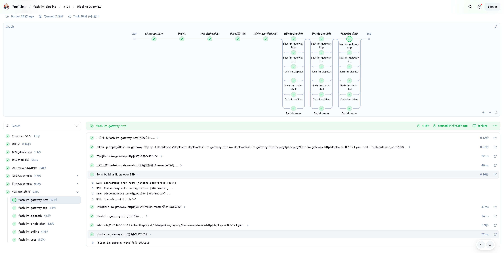

**部署到k8s集群**  
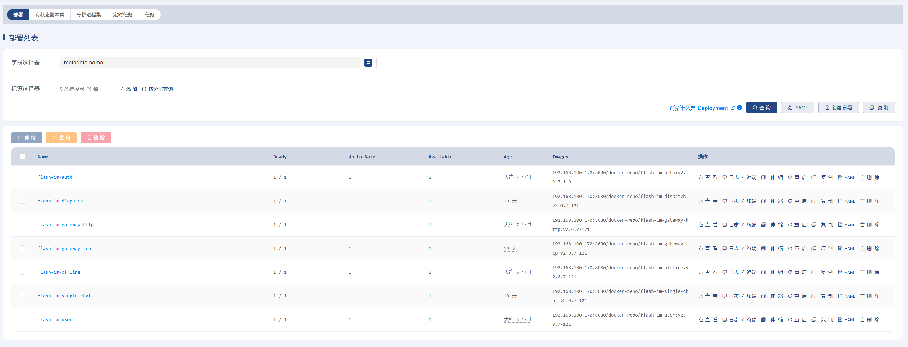

**登录**  
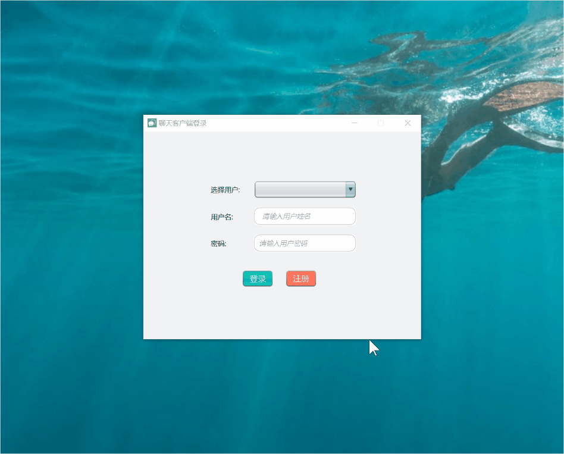

**添加好友**  
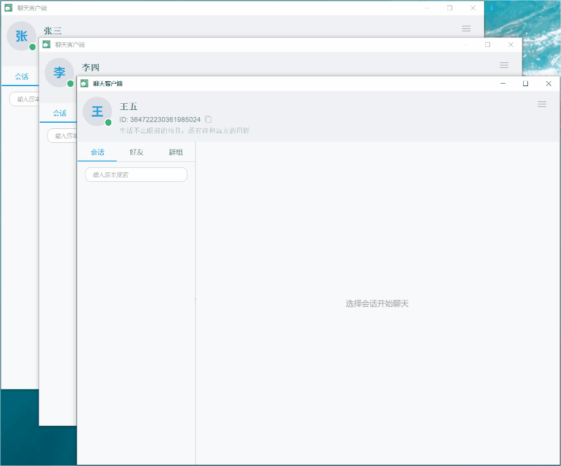

**创建群聊**  
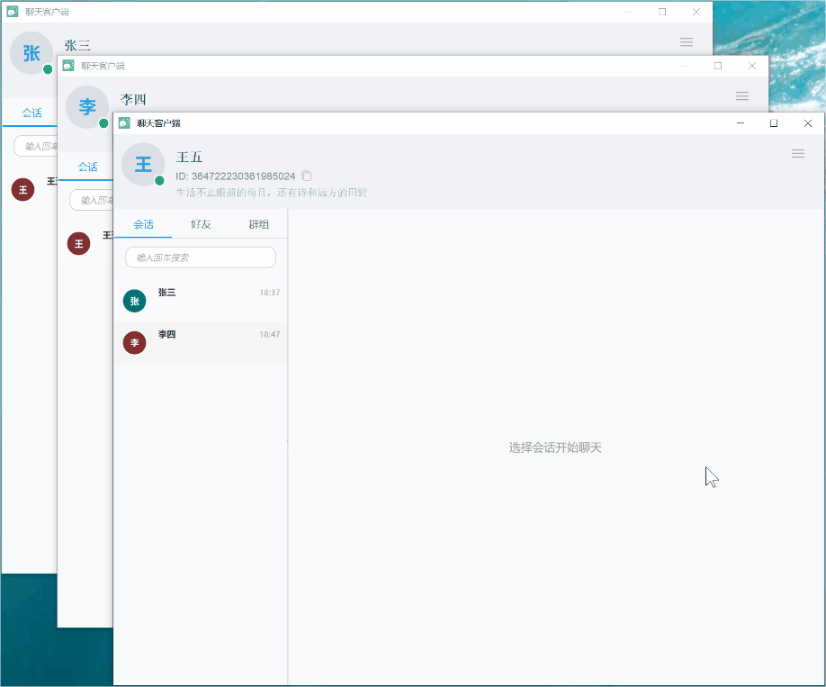

**单聊**  
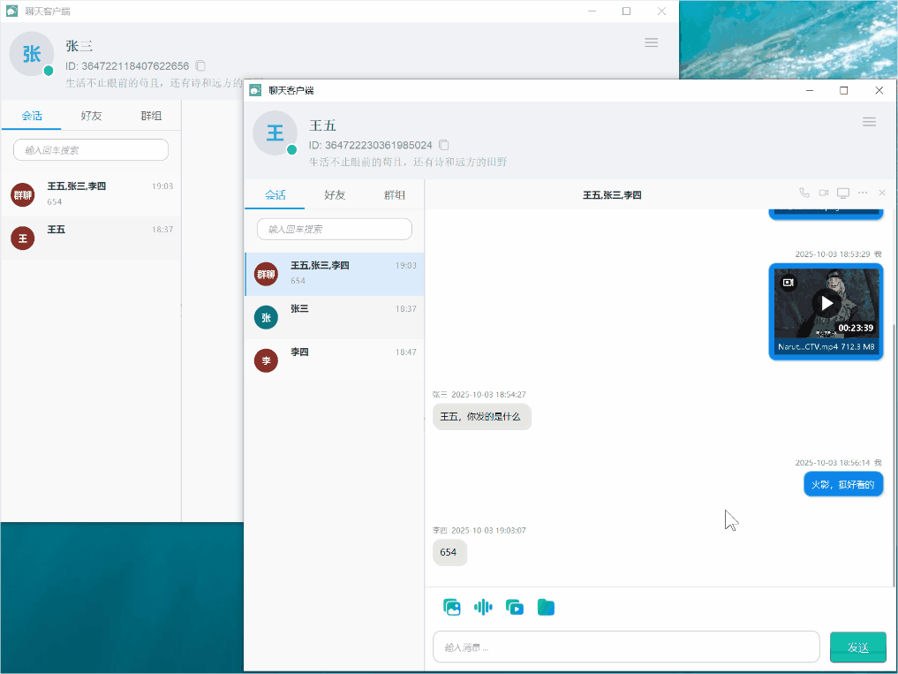

**群聊**
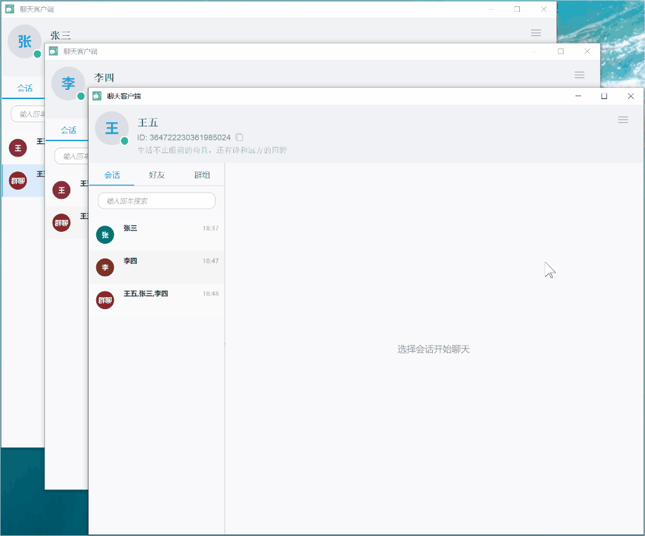

**语音通话**
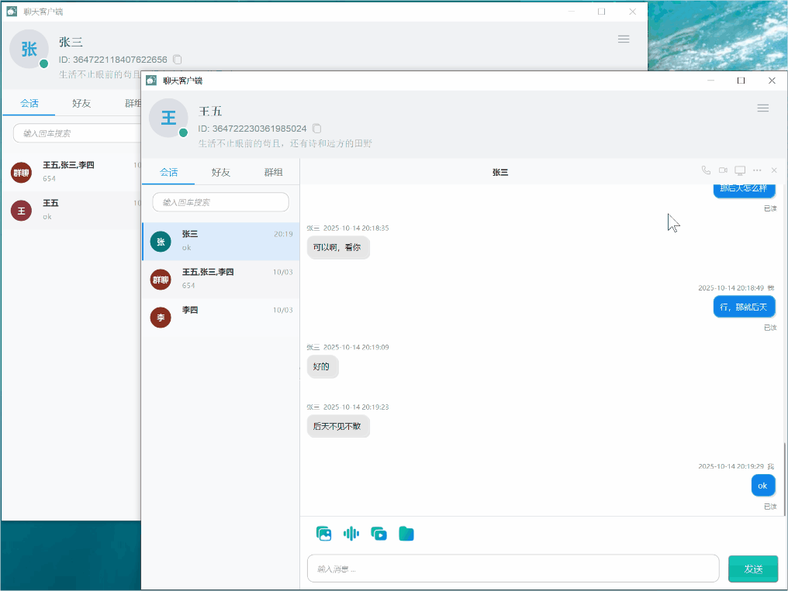

**视频通话**
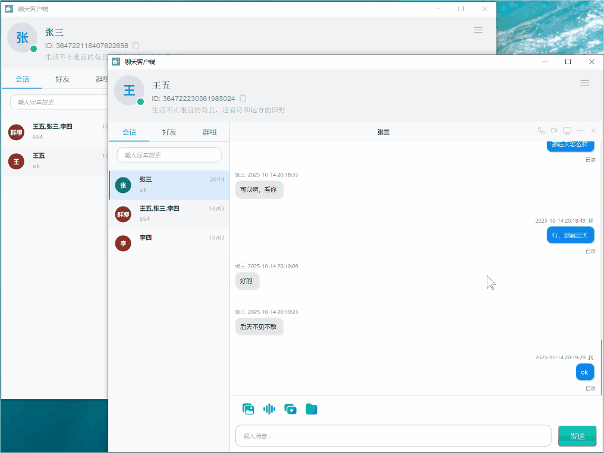

**桌面共享**
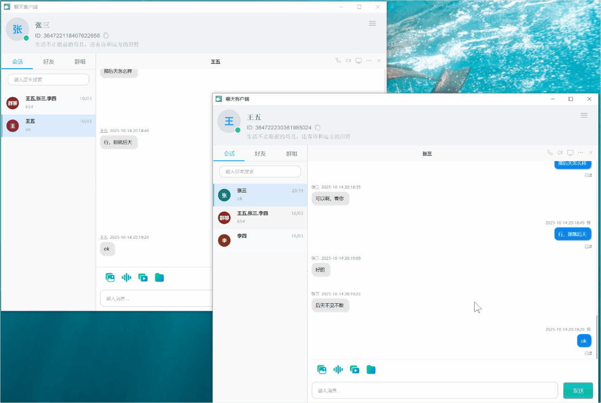

## IM架构设计
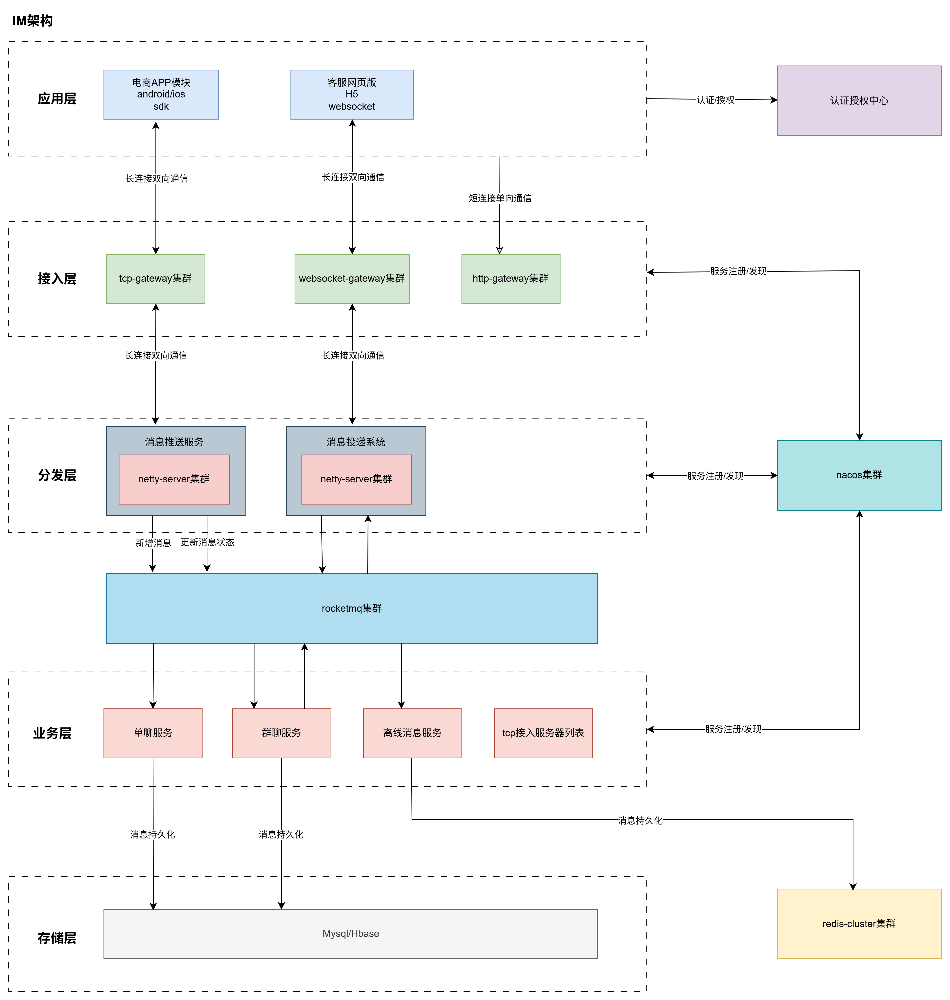

## 消息流转时序
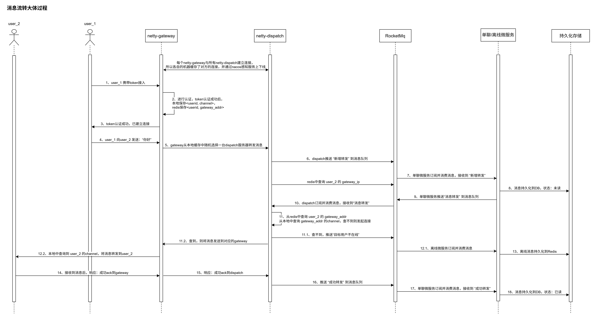

## 技术栈
- 应用层：
    - 桌面应用程序：Java Swing、Netty、SQLite、JavaCV、FFmpeg、JCEF、Mediasoup
- 网关层：
    - TCP网关：Spring Boot、Netty、Nacos、Redis、LoadBalancer、HttpClient、JWT
    - HTTP网关：Spring Cloud Gateway、LoadBalancer、Nacos、JWT
- 分发层：spring boot、netty、nacos、redis、rocketmq
- 微服务层：
    - 单聊服务：Spring Boot Web、Nacos、RocketMQ、MySQL
    - 离线服务：Spring Boot Web、Nacos、RocketMQ、MySQL、Redis
    - 用户服务：Spring Boot Web、Nacos、MySQL、Redis
    - 认证服务：Spring Boot Web、Security、Nacos、MySQL、Redis
    - 文件服务：Spring Boot Web、Nacos、MySQL、MinIO
    - Mediasoup服务: WebRTC 视频会议、语音通话和实时数据流服务器
- 存储层：MySQL、Redis

- 部署方案：
  - 快速环境搭建：Docker Compose部署（MySQL、Nacos、Redis、RocketMQ、MinIO、Coturn、Mediasoup）
  - 生产环境：自动化部署（K8s + Jenkins + GitLab + Harbor）

## 项目模块解析
### 目录结构
```text
guru-im/
├── asset/                          # 资源文件
├── doc/                            # 文档
│   ├── devops/                     # 运维文档
│   ├── docker/                     # Docker配置
│   ├── k8s/                        # K8s配置
│   └── sql/                        # 数据库脚本
├── guru-im-common/                 # 公共模块
├── guru-im-core/                   # 核心通信包
├── guru-im-demo/                   # 客户端示例
├── guru-im-mediasoup/              # 媒体服务
├── guru-im-protocol/               # 通信协议
├── guru-im-sdk-java/               # Java SDK
├── guru-im-service/                # 微服务集合
│   ├── guru-im-auth/               # 认证服务
│   ├── guru-im-dispatch/           # 消息分发
│   ├── guru-im-file/               # 文件服务
│   ├── guru-im-gateway-http/       # HTTP网关
│   ├── guru-im-gateway-tcp/        # TCP网关
│   ├── guru-im-group-chat/         # 群聊服务
│   ├── guru-im-job/                # 定时任务
│   ├── guru-im-offline/            # 离线服务
│   ├── guru-im-signal/             # 信令服务
│   ├── guru-im-single-chat/        # 单聊服务
│   └── guru-im-user/               # 用户服务
├── guru-im-starter/                # 公共Starter
│   ├── guru-im-cache-spring-boot-starter/      # 缓存配置
│   ├── guru-im-core-spring-boot-starter/       # 核心配置
│   ├── guru-im-mq-spring-boot-starter/         # 消息队列配置
│   ├── guru-im-nacos-spring-boot-starter/      # 注册中心配置
│   ├── guru-im-remote-spring-boot-starter/     # 远程调用配置
│   └── guru-im-security-spring-boot-starter/   # 安全配置
└── pom.xml
```

#### 公共模块 (guru-im-common)
- 定位：公共基础包
- 功能：工具类、常量定义、枚举类型、数据模型

#### Netty通信模块
- 核心通信包 (guru-im-core)：基于Netty的双向通信核心实现
- 消息分发 (guru-im-dispatch)：基于Netty+RocketMQ的消息分发与投递
- 客户端示例 (guru-im-demo)：Netty客户端接入示例
- TCP网关 (guru-im-gateway-tcp)：用户连接管理、消息转发
- WebSocket网关：已融合到TCP模块，通过配置启动参数切换

#### 微服务模块
- 认证服务 (guru-im-auth)：基于Spring Security + JWT的用户认证
- HTTP网关 (guru-im-gateway-http)：基于Spring Gateway的请求路由
- 单聊服务 (guru-im-single-chat)：单聊消息处理与持久化
- 离线服务 (guru-im-offline)：离线消息存储与推送
- 用户服务 (guru-im-user)：用户信息管理、好友关系
- 文件服务 (guru-im-file)：MinIO分片文件上传下载
- 信令服务 (guru-im-signal)：WebRTC信令转发、会议房间管理

#### 公共Starter模块
- 缓存配置：Redis缓存自动配置
- 核心配置：Spring基础上下文配置
- 消息队列：RocketMQ自动配置
- 注册中心：Nacos服务发现与配置管理
- 远程调用：负载均衡RestTemplate
- 安全配置：JWT生成与校验

### 亮点
- 双向通信：网关同时集成Netty服务端（用户连接）与客户端（分发系统连接）
- 消息队列解耦：服务间通过MQ解耦，提升系统并发处理能力
- 无状态服务：支持水平扩展，应对高并发场景
- K8s原生支持：通过配置实现TCP协议流量转发
- 多媒体支持：集成语音视频会议等高级功能
- 完整示例：提供完整业务功能示例，验证架构健壮性
- 技术全面：覆盖前后端完整技术栈，适合学习参考

### 不足
- 部分硬编码写死：待做成可配置
- 模块划分上还不够细：存在引用依赖冗余
- 桌面程序开发经验不足：示例中的demo界面还不够精致美观
- 有时候急着实现和调试，很多地方的代码注释还不够，但关键的注释还是有的，需要交流请联系

### netty通信设计
- 核心消息类：ImMessage，支持类型request（请求）、response（响应）、oneway（单向）
- 核心消息处理类：MessageProcessManager，封装不同消息类型的通用处理逻辑，提供核心的消息发送和消息处理实现
- Netty的编解码：ImMessageDecoder、ImMessageEncoder，LengthFieldBasedFrameDecoder + Protobuf序列化
- 异步回调：基于消息ID的响应回调机制
- 流控设计：Semaphore防止资源过载

### 消息可靠性保障
解决方案：
- 客户端：
    - 消息确认机制，支持失败重试
    - 上线时加载离线消息，序列号异常时触发补拉
    - 已读回执同步
    - 消息幂等处理
- 服务端：
    - 消息持久化与状态管理
    - 转发失败即时重试
    - 失败消息转为离线存储

### 消息顺序性保障
- 顺序问题：在分布式系统中，消息可能乱序到达。我们需要在客户端和服务器端都采取一些措施来保证消息的顺序。
- 解决方案：
    - 会话级序列号：严格递增的sequenceId + clientSeq
    - 客户端保证：上条消息ACK确认后才发送下一条
    - 服务端保证：分发系统维护消息顺序，单聊服务顺序处理


- 具体实现：
    - 客户端
        - 首次打开聊天会话时
            1. 从sqlite中加载历史消息20条，从sql中加载该会话最大的maxClientSeq并缓存下来
        - 发送消息
            1. 根据输入，生成消息，sequenceId=-1，status=发送中，clientSeq = maxClientSeq + 1
            2. 将消息保存到本地sqlite
            3. 通过Netty发送消息到服务器
            4. 更新ui显示消息以及消息发送状态为发送中
            5. 发送失败的消息可配置后台自动重发或手动双击消息重发
        - 接收消息
            1. 如果收到ack确认消息，更新本地数据库，status=已送达/发送失败，sequenceId=newSequenceId,更新ui显示已发送/发送失败
            2. 更新本地数据库该消息的sequenceId 和 status
            3. 对当前加载的消息列表重排序
            4. 如果收到来自好友的消息，保存到sqlite，加入消息列表，对消息列表按（sequenceId，clientSeq）排序并展示
    - 服务端
        - 分发系统
            1. 为messageId（snowflake）和sequenceId（会话级严格递增id）
            2. 推送完整的消息到mq
            3. 收到单聊微服务的mq消息
            4. 转发消息到消息的接收者（sequenceId）
        - 单聊微服务
            1. 收到完整的消息
            2. 保存消息到数据库
            3. 推送消息到rocketmq

### 消息安全性保障
解决方案：
- 传输加密：TLS传输层加密
- 连接认证：首次连接Token校验

### 收获与成长
- 深入掌握Netty框架原理与实战应用
- 提升分布式系统架构设计与落地能力
- 熟练云原生技术栈（K8s、Docker、Jenkins）
- 精通Spring Cloud微服务架构
- 熟练掌握中间件（Nacos、RocketMQ、Redis）
- 增强异步编程与并发处理能力
- 掌握多媒体流处理技术
- 提升桌面应用开发能力
- 深化网络异常处理经验


### 参考项目
- Java项目实战《IM即时通信系统》
- RocketMQ 5.2.0 Netty通信实现
- GitHub项目JiChat设计思想
- GitHub项目fastim实现方案
- 部分功能通过AI辅助实现


### 交流
个人邮箱：973667683@qq.com

### 总结：
从构思到实现，整个开发过程带来了丰富的技术收获和成就感。